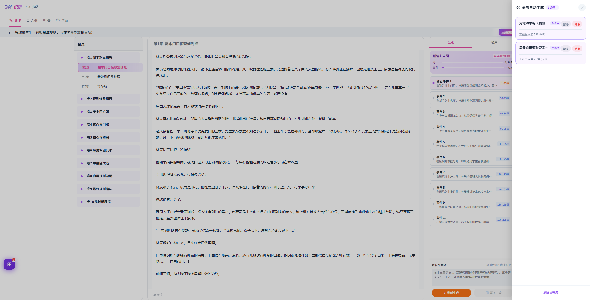

# Self-Evolution AI Coding

自进化 AI Coding 是一套面向 AI 编程的工程治理 Skill。

它的目标不是让 AI 一次性多写几行代码，而是让 AI 在长期项目里少重复犯错：先理解项目，再动手开发；先识别边界，再做重构；先留下验收证据，再交付结果。

很多 AI 编程失败并不是模型不会写代码，而是项目缺少一套可复用、可验证、可进化的工作制度。你在一次对话里提醒过的数据库红线、服务边界和重构顺序，如果没有进入可调用的规则系统，换一个任务入口就可能失效。这个 Skill 解决的就是这类“经验无法沉淀”的问题。

## 核心定位

Self-Evolution AI Coding 把每个项目当作长期商业化工程处理，而不是一次性 Demo。

它强调：

- 技术栈要有唯一事实源，避免后期漂移。
- 项目结构要有地图，避免无脑全局搜索。
- 业务能力要有唯一 owner，避免重复实现。
- 重构必须渐进闭环，避免大爆炸式重写。
- AI 入口、Prompt、Skill、Memory、Evaluator 要有清晰边界。
- 每次失败都要判断是否值得沉淀，形成下一次的预防规则。

一句话：

> 让 AI 编程从“临时发挥”变成“按制度执行，并且会从错误中进化”。
## 适合解决的问题

这个 Skill 适合用于：

- 新项目初始化和工程治理文件生成；
- AI 编程项目的长期维护；
- 大文件拆分、重复实现清理、架构漂移治理；
- 旧系统能力迁移和旧库兼容；
- Agent、数字员工、AI 产品底座的工程边界设计；
- Prompt 到 Skill 的迁移；
- AI 生成代码的验收、回测和错题本沉淀；
- 避免页面、路由、controller 直接承载业务规则；
- 防止 API route 直接写 SQL、前端直接拼复杂 Prompt 或直连模型 SDK；
- 建立项目级 Skill 路由和长期可复用工程制度。

它不适合拿来替代具体业务判断。业务需求、产品价值、用户路径和商业约束仍然需要人来确认。

## 项目案例

Skill Pack 的规则来自真实 AI 工程项目中的长期实践，主要包括：

- [织梦 AI](https://moliaiic.xyz/)：[织梦 AI](https://moliaiic.xyz/)是一个AI故事剧本与视频创作平台，织梦AI有非常复杂的算法和工作流，全部都是用这个skill+AI做的，很少返工，感兴趣可以点链接看实际效果
- 产品层面

1. 结合互联网热点生成故事种子，然后经过大纲和卷就可以写作了；写作一章后可以直接转剧本和视频，方便做短剧的人低成本快速试错。

2. 内置情绪算法、自主行为引擎、大世界自演化引擎等能力，可以让故事“活过来”。区别于现在市场上很多写故事工具干巴巴地围绕主角叙事，角色没有情绪，像工具人。

3. 系统内置专业的剧本与镜头拆分算法，视频模块会自动拼接和调用资产，比如角色设定图、声纹等。不需要自己写提示词，也不需要手动组装。

4. 可以在队列上实现多个故事、剧本并行写作，实现真正的高产。

   

- 构架和技术层面

1、框架层包括提示词路由、多平台自适应UI、CI/CD、统一提示词路由、多层记忆自动处理机制、资产处理引擎等。

2、服务层有统一扣费、余额拦截、AI池、变量注册和组装服务。

- 后续更新、AI具体的实践案例和 AI 编程工作流，也可以关注我公众号：


## 快速开始

把本 Skill 放到 Codex Skill 目录后，在新项目或空项目根目录执行：

```powershell
python "$env:USERPROFILE\.codex\skills\self-evolution-ai-coding\scripts\scaffold_governance.py" --project-root .
```

如果要指定项目名：

```powershell
python "$env:USERPROFILE\.codex\skills\self-evolution-ai-coding\scripts\scaffold_governance.py" --project-root . --project-name "项目名"
```

已有治理文件默认不会被覆盖。如果确实要重建模板，可以显式传入：

```powershell
python "$env:USERPROFILE\.codex\skills\self-evolution-ai-coding\scripts\scaffold_governance.py" --project-root . --overwrite
```

## 生成的治理文件

脚手架会在项目中生成一组控制文件：

| 文件 | 作用 |
| --- | --- |
| `PROJECT_MAP.md` | 项目地图，记录模块、入口、服务边界、关键文件和残留风险。 |
| `TECH_STACK_DECISION.md` | 技术栈唯一事实源，防止框架、运行时、数据库和工具链漂移。 |
| `PROJECT_DEVELOPMENT_MANUAL.md` | 项目开发手册，记录长期稳定的工程规则和工作方式。 |
| `COMMERCIAL_ACCEPTANCE_CRITERIA.md` | 商业化验收标准，防止死文件、重复服务、测试缺失和数据库误改。 |
| `AI_CODING_MISTAKE_NOTEBOOK.md` | AI 编码错题本，记录反复出现的问题、触发信号和预防方式。 |
| `COMMERCIAL_REFACTOR_LOG.md` | 重构日志，记录阶段性变更、验证结果和下一步。 |
| `SKILL_PORTABILITY_GUIDE.md` | Skill 迁移指南，说明哪些治理资产要随项目迁移。 |
| `.codex/skills/project-governance/SKILL.md` | 项目级 Skill 路由，只保留入口、必读文件和触发规则。 |

这些文件的重点不是“多写文档”，而是给 AI 一个稳定的项目大脑。下次开发前，AI 能先读项目地图、技术栈、验收标准和错题本，而不是每次从零开始猜。

## 工作流

### 1. 新项目初始化

先生成治理文件，再读项目结构。

初始化后至少要确认：

- 项目目标和核心用户是什么；
- 当前技术栈是否明确；
- 模块和入口是否能在项目地图里找到；
- 验收标准是否覆盖构建、测试、数据库、临时文件和重复实现；
- 项目级 Skill 路由是否存在。

### 2. 日常开发

每次改动前，先读取：

- `PROJECT_MAP.md`
- `TECH_STACK_DECISION.md`
- `COMMERCIAL_ACCEPTANCE_CRITERIA.md`
- 直接触碰的代码文件

涉及架构、支付、身份、数据库、AI 调度、跨端技术栈或大型重构时，再读取：

- `PROJECT_DEVELOPMENT_MANUAL.md`
- `AI_CODING_MISTAKE_NOTEBOOK.md`
- `COMMERCIAL_REFACTOR_LOG.md`
- 本 Skill 的相关 reference

### 3. 渐进重构

重构必须闭环渐进：

```text
能力盘点 -> 行为基线 -> 小切片抽取 -> 回测 -> 残留扫描 -> 删除旧实现 -> 更新地图
```

这里的关键不是“慢”，而是每一步都有证据。先知道旧能力在哪里，再建立行为基线；先小切片迁移，再扫描残留；旧实现删掉后，项目地图也要同步更新。

### 4. 能力迁移

旧项目能力迁移、AI 入口迁移、Prompt 到 Skill 迁移、模型池调整底层重构，都必须先回答几个问题：

- 当前能力的唯一 owner 是谁？
- 旧入口、旧 Prompt、旧 AIService 和旧数据库副作用在哪里？
- 哪些旧表语义必须兼容？
- 新链路如何留下 Trace、source facts、memory、Skill、model、tool、evaluation、evolution 和 billing 证据？
- 清理旧入口前，有哪些守卫测试能防止双轨复活？

这一步是为了避免“新系统看起来上线了，旧入口还在偷偷工作”的假完成。

### 5. 验收与回测

完成前必须检查：

- 技术栈是否符合 `TECH_STACK_DECISION.md`；
- 新文件是否能在项目地图或项目级 Skill 中找到；
- 是否误改数据库 schema；
- 是否保留了新旧双轨；
- 是否有临时文件污染正式项目；
- 是否跑了构建、测试或合理替代回测；
- 是否更新 `COMMERCIAL_REFACTOR_LOG.md`；
- 是否发现值得沉淀的新错误模式。

## Skill、Prompt、Memory、Evaluator 的边界

这个 Skill 的一个重要原则是：不要把 Prompt 当成第二套运行系统。

推荐边界：

- Skill：稳定方法、流程、工程约束、验收规则和工具路由。
- Prompt：本次任务目标、当前素材、输出格式和临时约束。
- Memory：长期稳定偏好、关系、状态和会影响未来决策的事实。
- Evaluator：用于判断产物是否达标，记录可复查的评估证据。

旧 Prompt 可以作为 Skill seed、Policy seed 或兼容数据，但不应该继续作为公开运行入口。

## 自进化机制

自进化不是把所有反馈都写进规则，而是判断哪些经验值得沉淀。

适合沉淀的情况：

- 同类错误重复出现；
- 错误跨文件、跨模块、跨对话复发；
- 涉及数据库、权限、支付、生产环境、密钥或用户数据；
- 会改变工作顺序，比如先查日志再修复、先确认 owner 再迁移；
- 能明显减少后续沟通成本；
- 能被测试、扫描、地图或日志验证。

不适合沉淀的情况：

- 只是一处局部实现偏好；
- 缺少证据；
- 会让治理文件无限膨胀；
- 只适合某个项目，不适合作为通用规则。

项目私有问题写入 `AI_CODING_MISTAKE_NOTEBOOK.md`。多项目通用问题再进入全局 `self-evolution-ai-coding`。

## 目录结构

```text
self-evolution-ai-coding/
├── SKILL.md
├── agents/
│   └── openai.yaml
├── references/
│   ├── ai-coding-reliability-research.md
│   ├── capability-migration-reliability.md
│   ├── commercial-engineering.md
│   ├── digital-employee-runtime.md
│   ├── governance-file-set.md
│   ├── prompt-skill-boundary.md
│   ├── self-evolution.md
│   └── stack-selection.md
└── scripts/
    └── scaffold_governance.py
```

## 设计原则

- `SKILL.md` 只做入口和工作流，不堆长规范。
- 大规则进入 `references/`，按任务需要读取。
- 项目私有规则写进项目控制文件，不污染全局 Skill。
- 技术栈由项目自己的 `TECH_STACK_DECISION.md` 决定，全局 Skill 只提供选择方法。
- 治理文件不能无限新增，能合并到已有文件就合并。
- 所有规则都要服务下一次更快定位、更稳执行、更少返工。

## License

本项目代码部分基于 Apache License 2.0 开源，详见仓库根目录的 [LICENSE](./LICENSE)。

项目名称、Logo、产品截图、宣传素材、课程内容、商业方案和未公开提示词资产不包含在本开源授权范围内。


